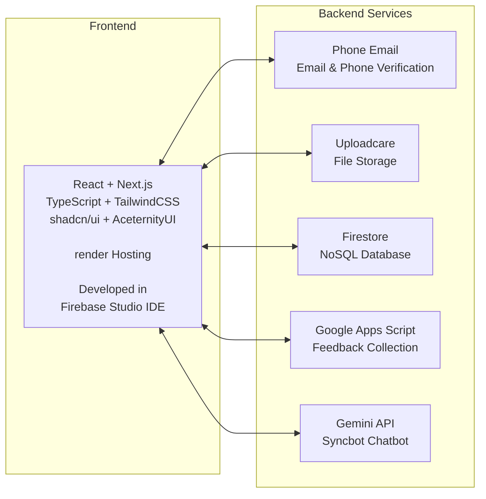

<h1 align="center"> 🩸 Donor Sync – Blood Bank Management System </h1>

> <p align="center"><strong>A comprehensive web-based platform that connects blood donors directly with hospitals, ensuring quick and efficient blood donation. It manages databases for donors, hospitals, and active donor organizations, streamlining the process and improving healthcare accessibility, with seamless connectivity between donors, patients, hospitals & organizations. 🎯</strong></p>


<div align="center">


</div>

## ✨ Context 


## 🚀 Features

- *🔗 Donor-Hospital Connection*: Directly links blood donors with hospitals for real-time donation requests.
- *📊 Database Management*: Stores and manages detailed information on blood donors, hospitals, and active donor organizations.
- *📈 Donation Tracking*: Tracks blood donation records and availability, ensuring transparency and faster access.
- *🔒 User Access*: Secure access for hospitals, donors, and partner organizations.
- *⚡ Efficiency*: Reduces delays in emergency cases through an automated system.

## 📊 Usage

1. *Patients*: Register and request for specific blood types.
2. *Donors*: Register and find places where blood is needed.
3. *Hospitals*: Request blood directly from registered donors.
4. *Organizations*: Manage donation drives and support patients.

---

## ⚙️ Platforms

| Platform                                                       | Supported? |
| --------------------------------------------------------------- | ----------- |
| Web (any browser with JS functionality) + Fully Responsive       | ✅          |

## 🛠 Tech Stack *



## 🚀 Getting Started *

### Web Frontend: Install & Run the Project 

1. Clone & Download the Repo

2. Install NodeJS on your system.

3. Open the project in your preferred IDE.

4. Run in Terminal to Install all dependancies:
   ```bash
   npm i
   ```

4. Get all api keys in env.template as set them in your env:

5. Run in Terminal to Start Development Server:
   ```bash
   npm run dev
   ```


## 📁 Project Architecture
```
donor-sync/
└── README.md & LICENSE etc.
└── frontend-web/
    ├── app/
    │   └── …                     # Top-level Next.js app directory (routes, layouts, pages, etc.)
    ├── components/
    │   └── …                     # Reusable UI components (buttons, forms, cards, etc.)
    ├── context/
    │   └── …                     # React Contexts for state management across components
    ├── data/
    │   └── …                     # Static data, seed data, or JSON fixtures used in the app
    ├── hooks/
    │   └── …                     # Custom React hooks (e.g. for fetching, authentication, etc.)
    ├── lib/
    │   └── …                     # Library code: utilities, helper functions, wrappers over APIs
    ├── public/
    │   └── …                     # Static assets (images, icons, fonts, etc.)
    ├── types/
    │   └── …                     # TypeScript type definitions and interfaces
    ├── firebaseConfig.ts          # Firebase setup / initialization logic
    ├── firebaseFunctions.ts       # Cloud Functions or server-side Firebase logic
    ├── next.config.ts             # Next.js configuration
    ├── tailwind.config.ts         # Tailwind CSS configuration
    ├── tsconfig.json              # TypeScript configuration
    ├── env.template               # Template for environment variables (API keys, etc.)
    ├── firebase.json              # Firebase project settings, rules, etc.
    ├── database.rules.json        # Firestore database rules
    ├── package.json               # Project dependencies & scripts
    ├── eslint.config.mjs          # Linting rules
```

## 📱 Screenshots

<table> <tr> <td><strong>Landing Page</strong><br><br>  </td> </tr> <tr> <td><strong>Authentication</strong><br><br>  </td> </tr> <tr> <td><strong>Donor Blood Donation Search</strong><br><br>  </td> </tr> <tr> <td><strong>Donor Profile</strong><br><br>  </td> </tr> <tr> <td><strong>Settings</strong><br><br>  </td> </tr> <tr> <td><strong>Community</strong><br><br>  </td> </tr> <tr> <td><strong>Syncbot AI Chatbot</strong><br><br>  </td> </tr> </table>

<!-- Stats removed for rebranding -->


## ✨ Icon


## 🔰 Banner


## ✍️ Endnote
<p align="center">⭐ Star this repo if you found it helpful! Thanks for reading.</p>

---

## 🏷 Tags

`#BloodBank` `#HealthcareTech` `#DatabaseManagement` `#WebApp` `#GBGChallenge` `#MedicalInnovation` `#BloodDonation` `#DonorManagement` `#HospitalManagement` `#FullStackDevelopment` `#HealthTech` `#EmergencyServices` `#DataManagement` `#CommunitySupport` `#HealthcareAccess` `#OpenSource` `#HealthcareInnovation` `#AIforSocialGood` `#BuildWithAI`
